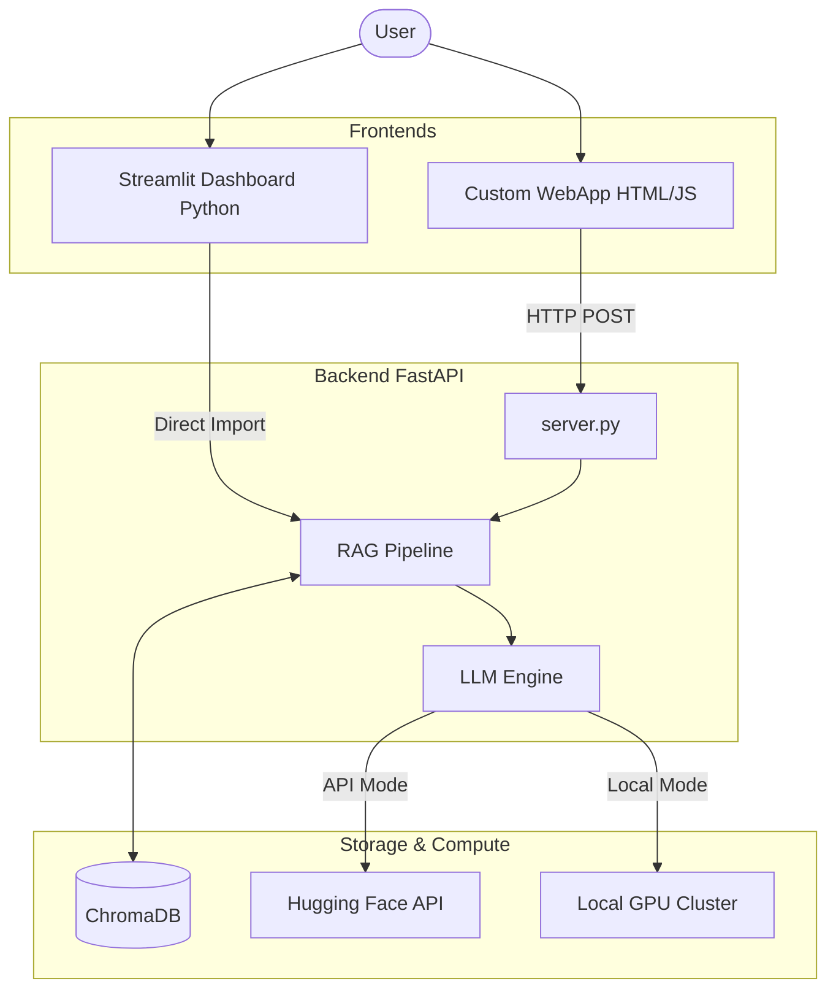

# ⚡ Spercer | Vehicle Spec Extraction Agent

**Spercer** is a state-of-the-art **Retrieval-Augmented Generation (RAG)** system designed to extract precise vehicle specifications from complex technical PDF manuals. It features a dual-interface design (Standard Streamlit & Premium WebApp) and a dual-inference engine (Cloud API & Local Cluster), wrapped in a high-fidelity "Glassmorphism" UI.

---

## 🏗️ System Architecture

The system operates on a **Client-Server** model where a unified Python backend (`server.py`) powers two distinct frontends.



---

## 🧠 Technical Deep Dive

### 1. The RAG Pipeline (`rag_pipeline.py`)
This is the core nervous system of the application. It handles document ingestion, processing, and retrieval.

*   **Ingestion Engine**: Uses `pymupdf4llm` to convert PDF pages into Markdown. We use `page_chunks=True` to strictly preserve page boundaries.
*   **Smart Chunking Strategy**: 
    *   **Table-Aware**: Detects Markdown table syntax (`|Header|...`) and groups entire tables into single chunks to prevent breaking tabular data.
    *   **Page-Aware**: Chunks never cross page boundaries, ensuring that retrieved context always comes from a specific, identifiable page.
    *   **Text Splitter**: Uses `RecursiveCharacterTextSplitter` with a chunk size of ~1200 characters and 200 overlap.
*   **Vector Storage**: `ChromaDB` (Persistent) stores the embeddings locally in `./chroma_db`.
*   **Embeddings**: We use the **BAAI/bge-m3** model (via `HuggingFaceEmbeddings`) for dense vector representations, chosen for its multi-lingual and rich semantic capabilities.

### 2. The LLM Engine (`llm_engine.py`)
Handles the generation and information extraction logic using **Meta-Llama-3.1-8B-Instruct**.

*   **Mode A: Cloud API (efficiency)**
    *   Uses `huggingface_hub.InferenceClient`.
    *   Connects to the hosted Inference API.
    *   **Pros**: Fast, runs on low-end hardware.
    *   **Cons**: Heavily quantized models, potential for lower precision.
*   **Mode B: Local Cluster (Power)**
    *   Uses native `transformers` and `torch`.
    *   Loads the full/half-precision model into VRAM (`device_map="auto"`).
    *   **Pros**: Maximum precision (Float16), privacy, no rate limits.
    *   **Cons**: Requires High-End GPU (16GB+ VRAM recommended).
*   **Structured Extraction**: 
    *   Uses a strict **System Prompt** to enforce JSON-only output.
    *   Includes a regex-based **JSON Parser** (`_parse_json_response`) to clean raw LLM outputs (stripping markdown backticks, handling erratic whitespace).

### 3. Backend API (`server.py`)
Built with **FastAPI** to serve the Custom WebApp.

*   **Endpoints**:
    *   `GET /`: Serves the `static/index.html`.
    *   `POST /api/query`: Accepts `{query: str, mode: "API"|"Local"}` and returns structured JSON data.
*   **Lazy Loading**: The RAG system is initialized only upon the first request to save startup time.

---

## 🎨 Frontend Implementations

### A. Custom Web Application (`static/`)
A premium, "Sci-Fi" inspired interface built with vanilla web technologies for maximum performance.

*   **Tech Stack**: HTML5, Vanilla CSS3, Vanilla JavaScript (ES6).
*   **Design Language**: **Glassmorphism**.
    *   Uses `backdrop-filter: blur(20px)` for frosted glass effects.
    *   **Dynamic Theming**: CSS Variables (`--hue`, `--primary-accent`) allow real-time switching between "Matrix Green" (API Mode) and "Warning Red" (Local Mode).
    *   **Animations**: Hardware-accelerated CSS transitions for hover states, modal popups, and theme morphing.
*   **Files**:
    *   `index.html`: Semantic structure.
    *   `style.css`: Contains complex gradients, keyframe animations, and responsive flexbox layouts.
    *   `script.js`: Handles DOM manipulation, API fetching (`fetch()`), and state management.

### B. Streamlit Dashboard (`streamlit_app.py`)
A rapid-prototyping interface for easy testing and Python-native usage.

*   **Features**:
    *   **Session State**: Manages chat history and RAG system persistence across re-runs.
    *   **CSS Injection**: Overrides default Streamlit styles to mimic the "Glassmorphism" look of the main web app (Custom backgrounds, neon fonts).
    *   **Sidebar Controls**: Allows toggling between API and Local compute modes on the fly.

---

## 📦 Setup & Installation

### Prerequisites
*   Python 3.10+
*   NVIDIA GPU (Optional, for Local Mode)
*   Hugging Face API Key

### 1. Installation
Install the required Python packages:
```bash
pip install -r requirements.txt
# Or manually:
pip install fastapi uvicorn python-dotenv langchain-huggingface langchain-community chromadb huggingface_hub transformers torch streamlit pymupdf4llm
```

### 2. Environment Setup
Create a `.env` file in the root directory:
```bash
HF_API_KEY=hf_your_access_token_here
```

### 3. Running the System

**Option A: The Premium WebApp (FastAPI)**
```bash
python server.py
# Access at http://localhost:8001
```

**Option B: The Streamlit Dashboard**
```bash
streamlit run streamlit_app.py
# Access at http://localhost:8501
```

---

## 📂 Project Structure

```text
Predi Shit11/
├── PDFs/                   # Source Documents
├── chroma_db/              # Vector Database (Generated)
├── static/                 # Frontend Assets
│   ├── index.html          # WebApp Entry
│   ├── style.css           # Global Styles
│   └── script.js           # Frontend Logic
├── internal_modules/       # (Concept)
├── llm_engine.py           # Model Inference Logic
├── rag_pipeline.py         # RAG & Vector Logic
├── server.py               # FastAPI Backend
├── streamlit_app.py        # Streamlit Interface
└── requirements.txt        # Dependencies
```
